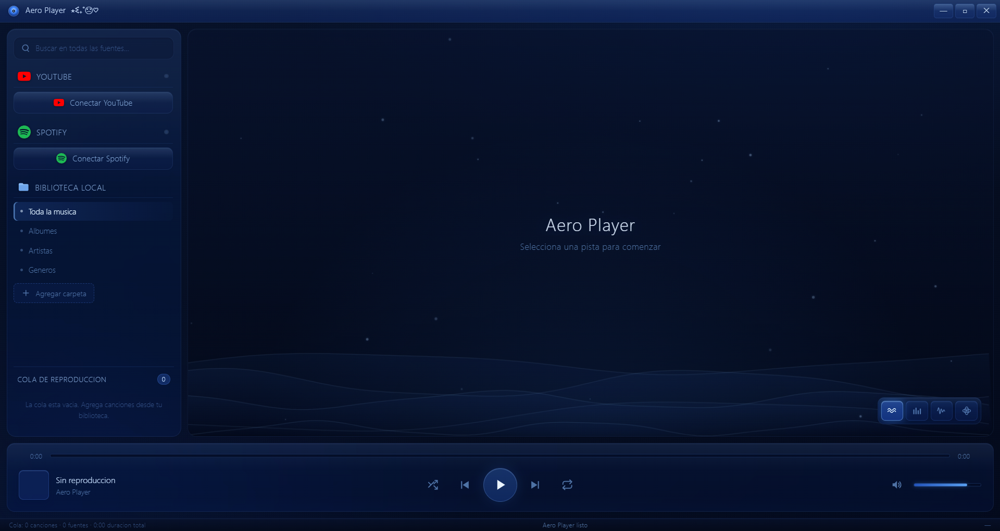

# Aero Player


Media player de escritorio con estetica Windows 7 Aero "Liquid Glass". Reproduce
tu musica local, videos de YouTube y canciones de Spotify desde una sola cola
unificada, acompanados de un visualizador de audio en tiempo real con cuatro
modos de animacion.

Construido sobre **Tauri 2 + WebView2**, lo que aprovecha el motor Edge nativo
de Windows (incluye Widevine sin necesidad de firmas adicionales) y produce un
binario mucho mas liviano que Electron.



---

## Instalacion rapida

Requisitos previos:

- [Node.js 20 o superior](https://nodejs.org)
- [Rust + Cargo](https://rustup.rs/) (cualquier toolchain estable reciente)
- En Windows: **MSVC Build Tools** (Visual Studio 2022) + **WebView2 Runtime**
  (ya viene preinstalado en Windows 10/11 actualizado)

Despues:

```bash
git clone https://github.com/lordvamp9/Aero-Player.git
cd Aero-Player
npm install
```

Para abrir la aplicacion en modo desarrollo:

```bash
npm run dev          # equivalente a "tauri dev"
```

Para generar el instalador de Windows (.msi y .exe NSIS):

```bash
npm run tauri:build
```

Los artefactos quedan en `src-tauri/target/release/bundle/`.

---

## Caracteristicas

Aero Player reune en una sola ventana tu musica local y dos plataformas en la
nube. La biblioteca local escanea carpetas completas de forma recursiva, lee los
metadatos ID3 de cada archivo (titulo, artista, album, genero, duracion y
caratula) y los organiza por album, artista o genero. YouTube se reproduce con
el reproductor oficial integrado y Spotify mediante su SDK de reproduccion web.

Todo se controla desde una cola unificada en la que conviven pistas de las tres
fuentes; puedes reordenarla arrastrando, agregar canciones soltando archivos
sobre la ventana y usar el menu contextual para gestionar cada pista. La interfaz
imita fielmente el cristal liquido de Windows 7 Aero, con reflejos, biseles,
sombras internas y la tipografia Segoe UI en peso light.

---

## Configuracion de credenciales

La musica local no necesita ninguna clave. YouTube y Spotify solo requieren
credenciales si quieres iniciar sesion y acceder a tus playlists personales.

1. Copia el archivo de ejemplo y renombralo a `.env`:

   ```bash
   copy .env.example .env      # en Windows
   cp .env.example .env        # en macOS / Linux
   ```

2. **Credenciales de Google / YouTube**
   - Entra en [Google Cloud Console](https://console.cloud.google.com).
   - Crea un proyecto y activa la **YouTube Data API v3**.
   - En "Credenciales" crea un **ID de cliente de OAuth 2.0** de tipo aplicacion
     de escritorio.
   - Agrega `http://127.0.0.1:3000/auth/google/callback` como URI de redireccion.
   - Copia el *Client ID* y el *Client Secret* dentro de tu `.env`.

3. **Credenciales de Spotify**
   - Entra en [Spotify Developer Dashboard](https://developer.spotify.com/dashboard).
   - Crea una aplicacion nueva.
   - Agrega `http://127.0.0.1:3000/auth/spotify/callback` como Redirect URI.
   - Copia el *Client ID* dentro de tu `.env` (Spotify usa PKCE, no necesita secret).

El archivo `.env` nunca se sube al repositorio (ya esta excluido en
`.gitignore`) ni se incluye dentro del instalador.

---

## Widevine / Spotify

A diferencia de versiones previas basadas en Electron, **Tauri usa WebView2**,
que ya incluye Widevine de forma nativa en Windows 10/11. **No hay que firmar
nada con EVS de castlabs** y Spotify reproduce sin pasos adicionales.

Si quieres verificar el soporte EME / Widevine de tu sistema:

```bash
npm run tauri:probe
```

Esto abre una ventana de diagnostico con la sonda Widevine.

---

## Desarrollo

| Comando | Descripcion |
|---|---|
| `npm run dev` | Inicia Vite + Tauri con recarga en caliente. |
| `npm run vite` | Solo el servidor Vite (sin Tauri). |
| `npm run build` | Genera el bundle estatico del renderer en `dist/`. |
| `npm run icon` | Regenera el icono `build/icon.ico` y `build/icon.png`. |
| `npm run clean` | Borra `dist/`, `release/` y `src-tauri/target/`. |
| `npm run tauri:build` | Compila el instalador (.msi y NSIS) para Windows. |
| `npm run tauri:probe` | Lanza la sonda Widevine para diagnostico EME. |

---

## Fuentes de audio soportadas

- **Archivos locales**: MP3, M4A, AAC, FLAC, WAV, OGG, OPUS y video MP4/WEBM/MKV/MOV.
- **YouTube**: reproduccion con la cuenta de Google a traves del reproductor oficial.
- **Spotify**: reproduccion con cuenta de Spotify Premium (requerido por la API).

---

## Visualizadores

El area central muestra un visualizador de audio que reacciona al sonido real
mediante la Web Audio API. Incluye cuatro modos seleccionables en la esquina
inferior derecha:

1. **Ondas liquidas**: cinco capas de ondas superpuestas con particulas flotantes
   y un brillo radial. Es el modo por defecto.
2. **Espectro de frecuencias**: barras FFT con gradiente vertical, reflexion
   espejada e indicadores de pico con caida suave.
3. **Forma de onda**: tres capas de la senal de audio sobre un sutil tunel de luz.
4. **Particulas orbitales**: un sistema de particulas que se dispersa con la
   energia de los graves y cambia de color segun la frecuencia.

Cuando no hay audio en reproduccion, el visualizador funciona en un modo demo
animado para que el escenario nunca se vea estatico.

---

## Estructura del proyecto

```
aero-player/
├── src-tauri/         Backend Rust (Tauri 2)
│   ├── src/
│   │   ├── main.rs
│   │   └── lib.rs     Comandos: scan_folder, read_metadata, oauth_listen
│   ├── capabilities/
│   ├── Cargo.toml
│   └── tauri.conf.json
├── src/renderer/      Interfaz (HTML, CSS Aero y logica en JavaScript)
│   └── js/aero-tauri.js   Puente window.aero sobre los plugins de Tauri
├── tauri-probe/       Sonda Widevine / EME (diagnostico)
├── build/             Recursos de empaquetado (icono, generadores)
├── vite.config.js
└── package.json
```

Ver `TAURI.md` para detalles de la migracion y arquitectura.

---

## Licencia

Distribuido bajo la licencia MIT.
